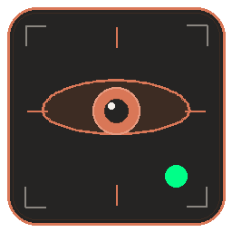

# Claude Code Auto-Bot

Auto-approves Claude Code permission prompts so you don't have to manually click "Allow" every time.

Uses OCR to monitor a screen region for configurable text, then automatically clicks and presses a key to approve.

> **Note:** This is an independent community tool. Not affiliated with or endorsed by Anthropic.



## How It Works

1. Position the scan overlay over Claude Code's input area
2. Click inside the scan area to place the reticle on the approve button
3. Hit **Engage** — the bot scans for "Allow" (or custom text) and auto-clicks + presses Enter when found

## Install

**Windows:**
```bash
pip install -r requirements.txt
python claude_code_auto_bot.py
```

**Mac:**
```bash
python install.py
python claude_code_auto_bot.py
```

**Linux:**
```bash
python install.py
python claude_code_auto_bot.py
```

The install script handles everything — Python packages and Tesseract OCR.

### Manual Install (if you prefer)

**Windows:**
```bash
pip install Pillow pyautogui winocr
```

**Mac:**
```bash
brew install tesseract
pip install Pillow pyautogui pytesseract
```

**Linux:**
```bash
sudo apt install tesseract-ocr
pip install Pillow pyautogui pytesseract
```

## Features

- **OCR-based detection** — scans for configurable text (default: "Allow")
- **Configurable key action** — default Enter, supports combos like `ctrl+enter`
- **Adjustable timing** — scan interval and cooldown between approvals
- **Live OCR readout** — see exactly what text is being detected
- **Resizable scan overlay** — drag edges/corners to fit any layout
- **Movable reticle** — click inside the scan area to target the approve button
- **Color themes** — 11 built-in themes including one that matches Claude's UI
- **Activity log** — color-coded log of all scans and approvals
- **Audio alerts** — optional sound on approval
- **Cross-platform** — Windows, Mac, and Linux

## Usage

```
python claude_code_auto_bot.py
```

| Control | Description |
|---|---|
| **Engage/Disengage** | Start/stop watching |
| **Interval** | Seconds between scans (default: 1.5) |
| **Cooldown** | Seconds to wait after an approval (default: 5) |
| **Scan For** | Text to look for (default: "Allow") |
| **Key** | Key to press after clicking (default: enter) |
| **Audio** | Toggle approval sound |
| **Theme** | Click to expand color theme picker |

### Overlay Controls

- **Top bar** — drag to move
- **Edges and corners** — drag to resize
- **Click inside** — place the reticle (click target)

## Building from Source

**Windows (.exe):**
```bash
build.bat
```

**Mac (.app):**
```bash
chmod +x build_mac.sh
./build_mac.sh
```

## Requirements

- Python 3.8+
- Windows, macOS, or Linux
- Tkinter (included with Python on Windows/Mac)

## Contributing

See [CONTRIBUTING.md](CONTRIBUTING.md) for guidelines.

## License

MIT
